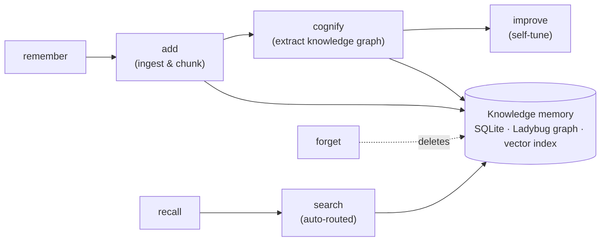
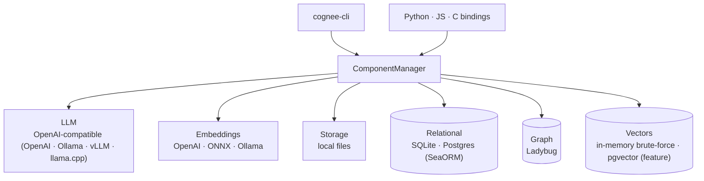

<div align="center">

<a href="https://github.com/topoteretes/cognee">
  
</a>

# Cognee-RS — Rust AI Memory

**On-device AI memory pipelines in Rust.** Turn raw text, files, and URLs into a
persistent, queryable knowledge graph through the `add → cognify → search`
pipeline — built to run on constrained devices (phone, smartwatch, embedded) and
to be a drop-in companion to the Python [`cognee`](https://github.com/topoteretes/cognee) SDK.

<p align="center">
  <a href="docs/getting-started.md">Getting Started</a>
  ·
  <a href="docs/README.md">Docs</a>
  ·
  <a href="docs/architecture.md">Architecture</a>
  ·
  <a href="https://github.com/topoteretes/cognee">Python cognee</a>
</p>

</div>

---

## How it works

The four-verb **memory API** (`remember` / `recall` / `improve` / `forget`)
composes the lower-level `add → cognify → search` pipeline. `remember` ingests
and builds the graph; `recall` auto-routes retrieval over it.



---

## Quick Start

The fastest way in is the `cognee-cli` binary and its memory API: **`remember`**
what you know, **`recall`** when you need it, **`improve`** the graph from
feedback, **`forget`** what's stale.

### Prerequisites

- **Rust toolchain** (edition 2024 workspace, resolver 3) — install via [rustup](https://rustup.rs).
- An **LLM API key** (OpenAI-compatible). `cognee-cli` hard-fails at startup if no
  LLM key is configured. A local endpoint (e.g. Ollama) works too, but you still
  pass a dummy key — see below.

> Differs from Python: there is no `pip install cognee`. You build the CLI from
> source with Cargo. There is no Cognee Cloud / hosted `serve` step in this repo.

### Build

```bash
cargo build --release   # -> target/release/cognee-cli
```

The default feature set wires the fully embedded, no-external-service stack:
**SQLite** (relational), **Ladybug** (graph), and an **in-memory brute-force
vector index** (Postgres + `pgvector` available behind a feature flag). Nothing
else to install.

```bash
# put it on your PATH for the snippets below
export PATH="$PWD/target/release:$PATH"
```

### Configure the LLM

A `.env` file in the working directory is auto-loaded. The **only** required
setting is the LLM API key:

```bash
export LLM_API_KEY="sk-..."        # canonical name (OPENAI_TOKEN is an accepted alias)
# optional overrides:
export LLM_MODEL="gpt-4o-mini"     # the compiled default is openai/gpt-5-mini
export LLM_ENDPOINT="https://..."  # alias: OPENAI_URL; empty -> OpenAI's API
```

> Differs from Python: **embeddings need a key by default too.** On
> desktop/server the default embedding provider is OpenAI
> (`text-embedding-3-small`, 1536 dims), reusing `LLM_API_KEY`/`LLM_ENDPOINT`. So
> setting `LLM_API_KEY` alone is enough for the full pipeline. To run embeddings
> fully local, set `EMBEDDING_PROVIDER=onnx` (or `ollama`).

**Fully local with [Ollama](https://ollama.com)** (LLM via Ollama, embeddings local):

```bash
ollama serve &
ollama pull llama3.2:3b

export OPENAI_URL=http://localhost:11434/v1
export OPENAI_TOKEN=not-needed      # dummy value still required — startup checks for a non-empty key
export OPENAI_MODEL=llama3.2:3b
export EMBEDDING_PROVIDER=ollama    # or onnx — otherwise embeddings still call OpenAI
```

### Your first memory

```bash
# store, then ask — this is the whole loop
cognee-cli remember "Cognee turns raw data into a queryable knowledge graph."
cognee-cli recall   "what does cognee do?"
```

`remember` ingests, builds the knowledge graph, and runs a self-improvement pass
(disable with `--no-improve`). `recall` auto-routes the search type for you when
`--query-type` is omitted.

**Session memory** — scope facts to a transient conversation cache instead of the
permanent graph:

```bash
cognee-cli remember "we ship Friday" --session-id chat-42
cognee-cli recall   "when do we ship?" --session-id chat-42
```

**Forget** — clean up (exactly one target is required):

```bash
cognee-cli forget --all              # everything you own
cognee-cli forget -d main_dataset    # one whole dataset
cognee-cli forget --data-id <uuid> --dataset-name main_dataset   # one item
```

**Improve** — nudge the graph from feedback:

```bash
cognee-cli improve -d main_dataset --node-name "Cognee" --feedback-alpha 0.1
```

### Memory API at a glance

| Command | Purpose | Shared flags |
|---|---|---|
| `remember <data…>` | add + cognify (+ improve) | `-d/--dataset-name`, `--session-id`, `--no-improve`, `--tenant-id` |
| `recall <query>` | smart search (auto-routes) | `-d/--datasets`, `-t/--query-type`, `-k/--top-k` (10), `--session-id`, `-f/--output-format` |
| `improve` | reinforce graph from feedback | `-d/--dataset-name`, `--session-id`, `--node-name`, `--feedback-alpha` (0.1), `--tenant-id` |
| `forget` | delete memory | one of `--all` / `-d` / `--data-id`+`--dataset-name`, `--tenant-id` |

> Flags are not uniform across subcommands: only `recall`/`search` accept
> `-t/--query-type`, `-k/--top-k`, and `-f/--output-format`; `forget` has no `-k`
> or `--session-id`. Mixing them across subcommands fails clap parsing.

> CLI config is also persisted at `~/.config/cognee-rust/config.json` (via
> `cognee-cli config set`). Precedence is **defaults < JSON config < env vars** —
> explicit env vars always win, but a stale `config.json` can override
> `.env`-implied defaults.

### Lower-level pipeline (optional)

`remember`/`recall` are convenience wrappers. For fine-grained control use the
explicit `add → cognify → search` stages, which exist as separate subcommands:

```bash
# 1. Ingest data into a dataset (defaults to "main_dataset")
cognee-cli add ./notes.txt "some inline text" -d my_dataset

# 2. Build the knowledge graph from one or more datasets
cognee-cli cognify -d my_dataset

# 1+2 in one step
cognee-cli add-and-cognify ./notes.txt -d my_dataset

# 3. Query it (defaults --query-type to GRAPH_COMPLETION)
cognee-cli search "Alan Turing" -t GRAPH_COMPLETION -k 10 -f pretty -d my_dataset
```

`search` is the lower-level retrieval primitive (`recall` wraps it with
auto-routing) and adds `--system-prompt` / `--system-prompt-path`. `add` also
accepts HTTP(S) URLs: the pipeline fetches the page or file, routes it by MIME
type, stores URL metadata, and — after `cognify` — can create `WebPage` /
`WebSite` provenance nodes for URL-sourced chunks.

Other subcommands: `memify` (enrich an existing graph with triplet embeddings),
`delete`, `config` (`get`/`set`/`unset`), `run-sequence`, and — when built with
their feature flags — `visualize`, `serve`, and `disconnect` (cloud). Run
`cognee-cli <command> --help` for the full flag list, or see
[docs/tools/cli.md](docs/tools/cli.md).

### Using it from Rust

There is a high-level one-call API — `cognee_lib::prelude::remember()` /
`recall()` / `forget()` / `improve()` — that mirrors the Python functions.
**Be aware:** these are not self-contained. Each takes a set of pre-built
`Arc<dyn …>` components (pipelines, LLM, storage, graph DB, vector DB, embedding
engine, session manager, …), so you must wire the component graph first. They
are "one call" only after the wiring.

The lowest-friction wiring root is `ComponentManager`, which lazily builds the
engines from env/`Settings`:

```rust
use cognee_lib::ComponentManager;
use cognee_lib::config::ConfigManager;

let cm = ComponentManager::new(ConfigManager::from_env());
let storage   = cm.storage().await?;
let database  = cm.database().await?;
let graph_db  = cm.graph_db().await?;
let vector_db = cm.vector_db().await?;
let embedding = cm.embedding_engine().await?;
let llm       = cm.llm().await?;
```

From there you build an `AddPipeline` and a `SearchOrchestrator` (via
`SearchBuilder`) and call `add(...)` / `cognify(...)` /
`orch.search(&SearchRequest{..})`. See [examples/add_example.rs](examples/add_example.rs),
[examples/cognify_example.rs](examples/cognify_example.rs), and
`crates/bindings-common/src/services.rs` (`CogneeServices::build`) for the
canonical wiring.

Honest caveats:

- **No ergonomic `Cognee` facade in the public `cognee-lib` crate.** The
  warm/add/cognify/search/`remember` object exists only in the Python/JS binding
  layers (backed by `CogneeServices` + `HandleState`). A pure-Rust user either
  re-implements that wiring or depends on the internal `bindings-common` crate.
- **`owner_id` is load-bearing:** resolve it with `get_or_create_default_user(...)`
  and `settings.default_user_email`, not a fresh `Uuid::new_v4()`, or dataset-name
  resolution across `cognify`/`search` won't find your data.
- Real `cognify` and meaningful search **require** a working LLM + embedding
  engine — there is no LLM-free end-to-end example.
- `MockGraphDB` / `MockVectorDB` (the `testing` feature) are smoke-test only —
  they don't persist a queryable graph.

If you want the ergonomic flow, reach for a **binding** instead (below).

## Language Bindings

The convenient `Cognee` class — `new(settings)` → `warm()` → `add()` /
`cognify()` / `addAndCognify()` / `search()` / `remember()` — is exposed by the
bindings, not the raw Rust crate. `warm()` resolves `owner_id` and builds +
caches the component graph once, giving you the wiring-free experience the
pure-Rust path lacks. All three bindings share the same SDK-tier implementation
via `crates/bindings-common/`, so their surfaces line up 1:1.

| Binding | README | Primary API |
|---|---|---|
| **Python** (PyO3) | [python/README.md](python/README.md) | `from cognee_py import Cognee` |
| **C API** (FFI) | [capi/README.md](capi/README.md) | `#include "cognee_sdk.h"` + `cg_sdk_*` |
| **JavaScript/TypeScript** (Neon) | [ts/README.md](ts/README.md) | `import { Cognee } from 'cognee-ts'` |

## About

**Cognee-RS** is a Rust-based experimental SDK for building **on-device AI
memory** pipelines. It's designed to run efficiently on constrained devices
(smartwatch, phone).

### Objectives

- **Small-model support**: run with on-device models (Phi4 class + embeddings).
- **90+ correctness**: keep the basic cognee ability to reach similar correctness
  to the Python Cognee SDK (90+%).
- **On-device vs Cloud ability**: transformation tasks + orchestration design
  support on-device and cloud mode. (Cloud prep is not the immediate goal, but
  we keep infra flexibility in mind.)
- **Multimodal support**: the POC supports multimodal data ingestion.
- **Retrieval**: optimally 3-4 sec on a reasonably sized knowledge base.

### Orchestration requirements

- **Memory Control**: control over the memory used by the ingestion pipeline.
- **CPU control**: control over threads and parallelization in the ingestion pipeline.
- **Autonomous task scheduling**: dynamic scheduling of memory-tasks.

## Technology Stack

The CLI and all three language bindings funnel through one wiring root —
`ComponentManager` — which lazily builds and caches the engines from
env/`Settings`:



- **Rust** — edition 2024 workspace (resolver 3).
- **Vector store** — in-memory brute-force (default); [pgvector](https://github.com/pgvector/pgvector) (Postgres, feature-gated). An optional Qdrant adapter lives in the closed `cognee-cloud-rs` companion.
- **Graph store** — embedded [Ladybug](https://crates.io/crates/lbug) graph database for knowledge-graph storage and traversal.
- **LLM** — OpenAI-compatible HTTP adapter (`OpenAIAdapter`, works with OpenAI/Ollama/vLLM/llama.cpp). On-device adapters (Android LiteRT) live in `cognee-cloud-rs`.
- **Embeddings** — multi-provider engine: local ONNX Runtime (BGE-Small-v1.5), OpenAI-compatible HTTP, Ollama, and a mock provider for tests.
- **Relational metadata** — SQLite/Postgres via SeaORM.

See [docs/architecture.md](docs/architecture.md) for the full crate-by-crate breakdown of the workspace.

## Documentation

Full documentation lives in **[docs/](docs/README.md)**. Quick links:

| Topic | Doc |
|---|---|
| Getting started (first run) | [docs/getting-started.md](docs/getting-started.md) |
| Core concepts & terminology | [docs/concepts.md](docs/concepts.md) |
| How-to guides | [docs/guides/](docs/guides/README.md) |
| Project parts & crate map | [docs/architecture.md](docs/architecture.md) |
| What each operation does | [docs/operations.md](docs/operations.md) |
| Configuration (env vars, settings) | [docs/configuration.md](docs/configuration.md) |
| Tools — CLI / bindings / HTTP / backends | [docs/tools/](docs/tools/README.md) |
| HTTP server reference | [docs/http-server/](docs/http-server/README.md) |
| Roadmap — gaps, open questions, plans | [docs/roadmap/](docs/roadmap/README.md) |
| API reference (rustdoc) | `cargo doc --no-deps --open` |

## Graph Backend Concurrency

For file-backed graph storage, Python's reference implementation documents a
default single-owning-process model for SQLite/Ladybug/LanceDB access, while
also supporting an opt-in Redis-backed shared Ladybug lock for multi-process
coordination. Rust currently matches that default model: Ladybug writes are
idempotent and serialized in-process, but cross-process locking is intentionally
out of scope.

## Running Tests

```bash
cargo test --workspace
```

For local full-suite execution (including LLM and ONNX/tokenizer dependent tests), use:

```bash
# Run the whole workspace (downloads embedding models if missing,
# single-threaded for LLM isolation):
bash scripts/run_tests_with_openai.sh

# Or a single test by name:
bash scripts/run_tests_with_openai.sh test_fact_extraction
```

## Observability

Cognee emits OpenTelemetry traces from every pipeline stage. To export them
to an OTLP collector:

```bash
cargo build --release --features telemetry
OTEL_EXPORTER_OTLP_ENDPOINT=https://otlp.your-collector:4317 \
  cognee-cli search --query "what did we ingest yesterday?"
```

See [`docs/observability/opentelemetry.md`](docs/observability/opentelemetry.md)
for the full guide (env vars, recipes for Grafana Tempo, Honeycomb, Dash0,
and in-cluster Collectors).

### Logging

Cognee writes structured logs to **stdout** and (when a writable directory is
available) to a rotating file, owned by the [`cognee-logging`](crates/logging/)
crate (`cognee_logging::init_logging`, called by the CLI and HTTP server). The
full env-var table (`COGNEE_LOG_*`, `RUST_LOG`/`LOG_LEVEL`, `LOG_FILE_NAME`) is
documented in [`docs/configuration.md` → Logging](docs/configuration.md#logging).
