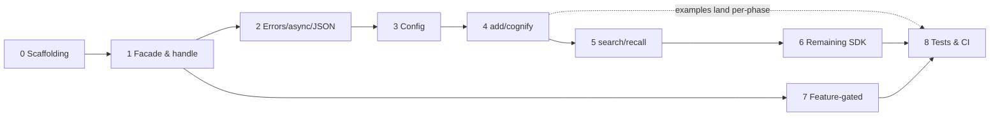

# C API Bindings — TS-Parity Plan (Index)

Status: **proposal / not started** · Owner: TBD · Last updated: 2026-06-11

This is the **overview and index**. The detailed, per-phase implementation plans live in this
folder (`docs/capi-bindings/phase-*.md`). This page holds the shared context every phase
depends on: the rationale, the current-state analysis, the target architecture, the locked
design decisions, the parity comparison table, the phase index, and the cross-cutting risks.

Progress is tracked in [STATUS.md](STATUS.md) (per-phase status, exit-criteria checklists, and
a decision log). To execute the plan, use the
[Task Execution Template](TASK-EXECUTION-TEMPLATE.md) — a self-contained orchestrator prompt
(designed for a Sonnet session) that drives all phases through four gated sub-agents per step
(plan-correction → implementation → review/validation → commit) and resumes from STATUS.md.

## Scope decisions (locked)

1. **Target = parity with the TypeScript bindings** (`js/`), which in turn reached full parity
   with `cognee-lib`'s public SDK API. The TS native surface (136 Neon exports in
   `js/cognee-neon/src/lib.rs`) is the authoritative checklist.
2. **Keep the existing low-level engine C API unchanged** (`cg_task_*`, `cg_pipeline_*`,
   `cg_value_*`, cancellation/progress/watcher/exec-status/thread-pool — 87 functions). It is a
   superset of what TS exposes for the engine and stays as-is.
3. **Marshalling is JSON-based**: options, data inputs, and results cross the C ABI as UTF-8
   JSON strings, mirroring the TS plan's "JSON-based, not the low-level `Value` trait"
   decision. No per-result C structs.
4. **The SDK facade is shared, not duplicated**: `HandleState`/`CogneeServices`/`SdkError`
   (currently living in `js/cognee-neon/src/{sdk,services,errors}.rs`) are hoisted into a new
   shared crate **`crates/bindings-common`** (`cognee-bindings-common`) so the C, JS, and
   (later) Python bindings consume one construction path while `cognee-lib`'s public API
   stays untouched. This resolves the TS plan's deferred question *"Promote `CogneeServices`
   to `cognee-lib`? Build in the binding first; extract once stable"* — it is now stable.
5. **SDK ops are async-only**: one exported function per op, callback-based, plus a single
   generic `CgSdkWaiter` sync bridge. No per-op blocking variants.

---

## 1. Rationale — the problem in one paragraph

`capi/` binds only `cognee-core`, the generic task/pipeline engine: values, task constructors,
pipeline builder/executor, cancellation, progress, watchers, exec-status, thread pool, runtime
init, logging, OTLP, and product analytics. The entire user-facing cognee SDK — `add`,
`cognify`, `search`, `recall`, `remember`, `memify`, `forget`, `update`, `prune`, `improve`,
datasets, sessions, notebooks, config, `visualize`, `serve` — is **absent**. The only available
`TaskContext` is the in-memory mock (`cg_task_context_mock`): a C caller cannot run
`add → cognify → search` against real backends at all. The TypeScript bindings closed exactly
this gap in 2026-06 (phases 0–9, all ✅ in
[typescript-bindings STATUS](../typescript-bindings/STATUS.md)); the C API should follow the
same proven path, reusing what that effort already built.

## 2. Current state (verified 2026-06-11)

**C API (`capi/cognee-capi`):**

- Workspace member (root `Cargo.toml` carries a TODO to extract it; see Phase 0).
- Depends on `cognee-core`, `cognee-database` (sqlite), `cognee-graph`/`cognee-vector`
  (**`testing` mocks only**), `cognee-logging`, `cognee-observability`, `cognee-telemetry`.
  **No dependency on `cognee-lib`.**
- 87 exported functions, all engine/infra-level. Header `capi/include/cognee.h` generated by
  cbindgen via `build.rs`.
- Error handling: `CgErrorCode` enum (11 codes) + thread-local `cg_last_error_message()`.
- Async model: global tokio runtime (`cg_init`/`cg_init_with_threads`), blocking execution via
  private single-thread runtime, background handles, C callbacks
  (`cg_pipeline_execute_async`).
- Build/check: CMake-driven `capi/scripts/check.sh` compiles and runs 6 examples + 3 smoke
  tests; `capi-check.yml` CI workflow.
- Known internal gap: `cg_pipeline_set_data_id_fn` implemented but not in the public header.

**TypeScript bindings (`js/`)** — the parity target:

- `cognee-neon` links `cognee-lib` (default features: `visualization`, `cloud`, `qdrant`,
  `ladybug`, `onnx`, `hf-tokenizer`, `tiktoken`, `sqlite`, `testing`).
- 136 native exports: SDK handle (new/warm/ownerId), 39 granular + 5 bulk config setters +
  `getConfig`, add/cognify/addAndCognify, search/recall, remember/rememberEntry/memify/improve,
  forget/update/pruneData/pruneSystem, 7 dataset ops, 5 session ops, pipeline-run resets,
  default user, 4 notebook ops, visualize/visualizeToFile, serve/disconnect, plus the legacy
  engine surface.
- Error model: 7-kind `SdkError` (+ config-specific kinds) → stable `kind`/`code` strings,
  re-wrapped into typed JS error subclasses.
- Keystone design: `CogneeHandle { Arc<HandleState> }` → `HandleState.services()` lazily
  builds and caches a `CogneeServices` bundle (6 raw engines + 10 derived services),
  invalidated by config version. Every `sdk_*` fn is:
  `let svc = handle.services().await?; <cognee-lib api>(…, svc.*); serialize`.

## 3. Target architecture

```
┌─ C consumer ──────────────────────────────────────────────────────┐
│  cg_sdk_new(settings_json) → CgSdk*                               │
│  cg_sdk_config_set(...) · cg_sdk_add(...) · cg_sdk_search(...)    │
│  async-callback ops + CgSdkWaiter sync bridge · JSON in/out       │
│  cg_task_* / cg_pipeline_* (existing engine API, unchanged)       │
└────────────────────────────────────────────────────────────────────┘
                  │ extern "C" — cognee.h (engine) + cognee_sdk.h (SDK)
┌─ Rust (capi/cognee-capi/src/, own workspace) ─────────────────────┐
│  sdk.rs        CgSdk { state: Arc<HandleState> } (opaque handle)  │
│  sdk_*.rs      thin wrappers: parse JSON → facade → cognee-lib    │
│                api → serde_json::to_string → callback             │
│  + existing engine modules (task/pipeline/value/watcher/…)        │
└────────────────────────────────────────────────────────────────────┘
                              │ depends on (path)
┌─ cognee-bindings-common (crates/bindings-common) — NEW, Phase 1 ──┐
│  HandleState · CogneeServices · SdkError · wire (JSON shapes)     │
│  (hoisted from cognee-neon; also consumed by js/cognee-neon)      │
└────────────────────────────────────────────────────────────────────┘
                              │ depends on
                cognee-lib (ConfigManager, ComponentManager, api/, …)
```

**Canonical call pattern** (every `cg_sdk_*` op):

```rust
let state = Arc::clone(/* from CgSdk handle */);
let opts = parse_json_opts(opts_json);                   // CG_ERR_VALIDATION on bad shape
spawn_sdk_op(cb, user_data, async move {
    let svc = state.services().await?;                   // lazy build, version-cached
    let result = cognee_lib::api::<op>(…, svc.…).await?; // the same call cognee-neon makes
    Ok(serde_json::to_value(result)?)                    // strict JSON, camelCase keys
});                                                      // callback fires exactly once
```

The callback receives `(CgErrorCode, const char* result_json, const char* error_message,
void* user_data)`. Synchronous callers use the generic `CgSdkWaiter`: create one, pass the
library-provided waiter callback + the waiter as `user_data`, then
`cg_sdk_waiter_wait(waiter, &result_json)` blocks until the callback fires.

## 4. Design decisions

All locked with the owner on 2026-06-11 (see the [STATUS decision log](STATUS.md)).

| # | Decision | Why |
|---|---|---|
| D1 | Hoist `HandleState`/`CogneeServices`/`SdkError` (+ shareable `wire` JSON helpers) into a **new `crates/bindings-common` crate** (`cognee-bindings-common`); refactor `cognee-neon` to consume it | Three bindings (C, JS, Python) must not drift; keeps `cognee-lib`'s public API untouched. The facade is stable and neon-free except for the throw helper, which stays in neon |
| D2 | Opaque `CgSdk*` handle with create/destroy; `Arc<HandleState>` inside, so handles are cheap to share across threads | Mirrors `CogneeHandle`; matches existing capi handle conventions |
| D3 | JSON strings for all option/input/result payloads, **camelCase keys, byte-identical to the TS wire shapes**; returned `char*` freed with existing `cg_string_destroy` | Avoids ~40 C struct definitions; the hand-built result builders hoist into `bindings-common` unchanged; TS docs/tests transfer 1:1 |
| D4 | SDK ops are **async-only**: one exported `cg_sdk_<op>(…, CgSdkResultCallback, void* user_data)` per op, spawned on the global runtime; delivery is **always deferred** (the callback never fires synchronously from the initiating call — the libuv/gRPC/ORT rule). Sync usage via one generic **single-use `CgSdkWaiter`** (create → pass the library waiter callback + waiter as `user_data` → `cg_sdk_waiter_wait` blocks until the callback fires) | Halves the exported surface (~28 fns instead of ~56); one canonical execution path; consumers never need reentrancy-safe callbacks; the waiter gives blocking ergonomics for simple C programs without per-op duplication |
| D5 | Extend `CgErrorCode` with SDK kinds (`CG_ERR_COMPONENT`, `CG_ERR_SERVICE_BUILD`, `CG_ERR_USER_BOOTSTRAP`, `CG_ERR_VALIDATION`, `CG_ERR_UNSUPPORTED`, `CG_ERR_FEATURE_NOT_BUILT`, `CG_ERR_UNKNOWN_CONFIG_KEY`, `CG_ERR_CONFIG_TYPE_MISMATCH`); async errors delivered via the callback's `error_message` param; thread-local `cg_last_error_message()` authoritative only for sync calls | 1:1 with the TS `kind` strings; preserves the established last-error pattern where it works |
| D6 | Default features mirror `cognee-neon` (`visualization`, `cloud`, `qdrant`, `ladybug`, `onnx`, `hf-tokenizer`, `tiktoken`, `sqlite`, `testing`); slim embedded build (`--no-default-features` + picks) compiles, verified in CI. Feature-absent functions stay exported and return `CG_ERR_FEATURE_NOT_BUILT` | Workspace-wide convention for binding/umbrella crates; typed runtime errors beat linker errors |
| D7 | Config surface = generic `cg_sdk_config_set(handle, key, value_json)` + `cg_sdk_config_set_str` + 4 bulk group setters + `cg_sdk_config_get`; **no granular typed setters** | `ConfigManager::set(key, value)` already dispatches all keys; 39 extern fns add surface without adding capability |
| D8 | **Split public headers**: `cognee.h` (engine, unchanged) + `cognee_sdk.h` (new SDK tier), both cbindgen-generated and committed; add `CG_API_VERSION_{MAJOR,MINOR}` defines + runtime `uint32_t cg_api_version(void)` | SDK-only consumers get a readable header; version symbols let dynamically-linking consumers verify the API generation at load time |
| D9 | **Strict JSON always** in `result_json`: every result is a valid JSON document — `true`/`false` for bools, quoted strings (uuid/path/html), `null` for void ops, objects/arrays as in TS | One uniform contract; generic tooling over the callback works without per-op knowledge |
| D10 | `cognee-capi` is **extracted into its own `[workspace]` under `capi/`** (honoring the root Cargo.toml TODO), mirroring the root `[patch.crates-io]` table the way `cognee-neon` does; `bindings-common` stays a root-workspace member consumed by path | Isolates FFI/testing-feature unification from the main workspace; accepted cost: patch-table maintenance in a third place |
| D11 | SDK symbols use the **`cg_sdk_*`** prefix; the three `cognee_*` observability entry points remain as-is | Consistent with the dominant `cg_` engine convention; visually separates the SDK tier |
| D12 | Tier-B live tests run **inside the existing `capi-check` CI job**, gated on secret availability (SKIP cleanly without `OPENAI_URL`/`OPENAI_TOKEN`, e.g. fork PRs), reusing the embedding-model caching from `lib-tests.yml` | Owner preference: the job already exists; live C-ABI coverage is worth the CI time |

## 5. Parity comparison table

Status legend: ✅ present · 🟡 partial · ❌ missing. "TS native export(s)" names the
authoritative reference implementation in `js/cognee-neon/src/`.

| # | Surface | TS native export(s) | C API today | Status | Phase |
|---|---|---|---|---|---|
| 1 | Runtime init/shutdown | `init`, `initWithThreads`, `shutdown` | `cg_init`, `cg_init_with_threads`, `cg_shutdown` | ✅ | — |
| 2 | Logging | `setupLogging` | `cognee_setup_logging` | ✅ | — |
| 3 | OTLP tracing | `setupTelemetry` | `cognee_init_otlp` | ✅ (same v1 subscriber limitation) | — |
| 4 | Product analytics | `setupTelemetryAnalytics` | `cognee_init_telemetry` | ✅ | — |
| 5 | Pipeline engine (tasks/values/exec/cancel/progress/watcher) | `pipeline.*` legacy namespace | 87 fns — **superset** of TS (adds exec-status vtable, thread pool, batch task variants) | ✅ | — |
| 6 | SDK handle lifecycle | `cogneeNew`, `cogneeWarm`, `cogneeOwnerId` | — | ❌ | [1](phase-1-shared-facade-and-handle.md) |
| 7 | Typed SDK error model | `SdkError` kinds + `throw_sdk_error` | engine codes only (11) | 🟡 | [2](phase-2-errors-async-json-conventions.md) |
| 8 | Config surface | 39 granular + 5 bulk setters + `getConfig` | — | ❌ | [3](phase-3-config.md) |
| 9 | `add` / `cognify` / `addAndCognify` | `cogneeAdd`, `cogneeCognify`, `cogneeAddAndCognify` | — | ❌ | [4](phase-4-core-ops.md) |
| 10 | `search` / `recall` | `cogneeSearch`, `cogneeRecall` | — | ❌ | [5](phase-5-retrieval.md) |
| 11 | Memory ops | `cogneeRemember`, `cogneeRememberEntry`, `cogneeMemify`, `cogneeImprove` | — | ❌ | [6](phase-6-remaining-sdk.md) |
| 12 | Data ops | `cogneeForget`, `cogneeUpdate`, `cogneePruneData`, `cogneePruneSystem` | — | ❌ | [6](phase-6-remaining-sdk.md) |
| 13 | Datasets | `cogneeListDatasets`, `cogneeListData`, `cogneeHasData`, `cogneeDatasetStatus`, `cogneeEmptyDataset`, `cogneeDeleteData`, `cogneeDeleteAllDatasets` | — | ❌ | [6](phase-6-remaining-sdk.md) |
| 14 | Sessions | `cogneeGetSession`, `cogneeAddFeedback`, `cogneeDeleteFeedback`, `cogneeGetGraphContext`, `cogneeSetGraphContext` | — | ❌ | [6](phase-6-remaining-sdk.md) |
| 15 | Admin (pipeline-run resets, default user, notebooks) | `cogneeResetPipelineRunStatus`, `cogneeResetDatasetPipelineRunStatus`, `cogneeGetOrCreateDefaultUser`, `cogneeListNotebooks`, `cogneeCreateNotebook`, `cogneeUpdateNotebook`, `cogneeDeleteNotebook` | — | ❌ | [6](phase-6-remaining-sdk.md) |
| 16 | Visualization (feature) | `cogneeVisualize`, `cogneeVisualizeToFile` | — | ❌ | [7](phase-7-feature-gated.md) |
| 17 | Cloud serve/disconnect (feature) | `cogneeServe`, `cogneeDisconnect` | — | ❌ | [7](phase-7-feature-gated.md) |
| 18 | Real backends linked (qdrant/ladybug/onnx/…) | default features in `cognee-neon` | mocks only (`testing` features) | ❌ | [0](phase-0-scaffolding.md) |
| 19 | Examples / tests / CI for the SDK surface | 13 jest suites, Tier-A/Tier-B split, example | engine-only examples + smoke tests | 🟡 | [8](phase-8-header-examples-tests-ci.md) |

Out of scope (same as the TS plan): HTTP routers, auth, permissions, the HTTP server surface.
Known TS-side stubs carry over identically: S3 inputs and recursive `dataItem` return
`CG_ERR_UNSUPPORTED`. Custom `MemifyConfig` extraction/enrichment tasks are out of **parity**
scope but — unlike in JS — ARE expressible in C (`MemifyTask` is JSON-in/JSON-out, a plain
function-pointer fit); reserved as a post-parity extension (`CgMemifyTaskFn`), see
[phase 6](phase-6-remaining-sdk.md). SDK-op cancellation is an explicit v1 non-goal with a
reserved extension shape, see [phase 2](phase-2-errors-async-json-conventions.md).

## 6. Phase index

| Phase | Doc | Outcome |
|---|---|---|
| 0 | [Scaffolding & build](phase-0-scaffolding.md) | capi extracted to its own workspace; links `cognee-lib` with real backends; size baseline |
| 1 | [Shared facade & SDK handle](phase-1-shared-facade-and-handle.md) | `bindings-common` crate created; `CgSdk` new/warm/owner-id/destroy; `cognee_sdk.h` + version symbols — the keystone |
| 2 | [Errors, async & JSON conventions](phase-2-errors-async-json-conventions.md) | Extended `CgErrorCode`, `CgSdkResultCallback` + `CgSdkWaiter`, JSON contract |
| 3 | [Config surface](phase-3-config.md) | All config settable from C; engine selection works |
| 4 | [Core ops](phase-4-core-ops.md) | `add`, `cognify`, `add_and_cognify` |
| 5 | [Retrieval](phase-5-retrieval.md) | `search`, `recall` |
| 6 | [Remaining SDK](phase-6-remaining-sdk.md) | memory/data/datasets/sessions/admin/notebooks |
| 7 | [Feature-gated surfaces](phase-7-feature-gated.md) | `visualize`, `serve`/`disconnect` |
| 8 | [Header, examples, tests & CI](phase-8-header-examples-tests-ci.md) | Regenerated `cognee.h`, SDK examples, extended `check.sh`, CI |

## 7. Sequence plan

Phase 1 is the de-risking keystone (exactly as in the TS plan); once the shared facade and the
handle exist, Phases 4–7 are mechanical ports of the corresponding `sdk_*.rs` neon modules.



1. **Foundation (strictly sequential): 0 → 1 → 2 → 3.** Nothing real works until the crate
   links `cognee-lib`, the shared facade exists, errors/async conventions are fixed, and
   config is settable.
2. **Core SDK (sequential, the value path): 4 → 5 → 6.** Search needs cognified data; the
   remaining API reuses the same marshalling.
3. **7 Feature-gated** depends only on Phase 1+2 — can overlap with track 2.
4. **8 Verification** is continuous: each op phase lands a C example/smoke test; final
   consolidation (header diff check, CI wiring, README) at the end.

### Milestones

| Milestone | Reached after | Demonstrable outcome |
|---|---|---|
| **M0 — Real backends compile** | 0 | capi in its own workspace, cdylib/staticlib links `cognee-lib` (qdrant/ladybug/onnx); engine examples still pass |
| **M1 — Shared facade** | 1 | `cognee-neon` + capi both consume `cognee-bindings-common`; `cg_sdk_new` + `cg_sdk_warm` work from C |
| **M2 — Graph built from C** | 3–4 | configure → `add → cognify` from a C program |
| **M3 — Round-trip query** | 5 | `add → cognify → search` from C |
| **M4 — Full TS parity** | 6–7 | every row in §5 ✅ |
| **M5 — Shippable** | 8 | regenerated header, runnable example, extended check.sh green in `capi-check` CI |

## 8. Cross-cutting risks & open questions

- **Workspace extraction churn (D10)** — extracting capi into its own workspace means the
  `[patch.crates-io]` qdrant forks (`tar`/`tonic`/`hyper`) are now maintained in **three**
  places (root, `js/cognee-neon`, `capi`). Mitigation: Phase 0 documents the mirroring rule
  in all three Cargo.toml files; consider a future drift-check script. Separate target dir =
  slower cold CI builds for `capi-check`.
- **Binary size** — staticlib/cdylib grows substantially with ONNX, qdrant, ladybug,
  tokenizers under the full default features (D6). Record a baseline in Phase 0; the
  CI-verified slim build (`--no-default-features` + picks) is the embedded story.
- **Facade hoist regression risk** — Phase 1 touches `cognee-neon` (re-pointing it at
  `bindings-common`). The full JS Tier-A suite must stay green in the same PR that moves the
  facade; treat `js/scripts/check.sh` as a Phase-1 exit criterion.
- **Waiter misuse** — `cg_sdk_waiter_wait` called from a tokio runtime thread (i.e. from
  inside another op's callback) would deadlock the worker. Mitigation: detect
  `Handle::try_current()` in `wait` and fail fast with `CG_ERR_RUNTIME`; document that
  callbacks must not block. The waiter is single-use; reuse → `CG_ERR_VALIDATION`.
- **Foreign-thread callbacks** — `CgSdkResultCallback` fires on tokio worker threads;
  UI/host frameworks that require thread affinity must marshal back themselves. If this
  bites (Android), the librdkafka-style alternative — a `cg_sdk_dispatch_poll()` that
  delivers queued callbacks on the calling thread — is the reserved extension; explicitly
  out of v1 scope.
- **SDK-op cancellation** — explicit v1 non-goal (TS parity); extension shape reserved in
  [phase 2](phase-2-errors-async-json-conventions.md).
- **String encoding** — all `const char*` inputs are UTF-8 (`CG_ERR_UTF8` on violation);
  document explicitly for Windows consumers.
- **Thread-safety contract** — `CgSdk` is `Send + Sync` (it wraps `Arc<HandleState>`); destroy
  must not race in-flight async ops (Arc keeps state alive — document that callbacks may fire
  after `cg_sdk_destroy`).
- **Header churn** — cbindgen output is checked in for **both** headers (`cognee.h`,
  `cognee_sdk.h`); every phase must regenerate and commit them (Phase 8 adds a CI freshness
  check covering both).

## 9. Reference map

| Concern | Location |
|---|---|
| Parity target (native exports) | `js/cognee-neon/src/lib.rs` (136 exports) |
| Facade to hoist (→ `crates/bindings-common`) | `js/cognee-neon/src/sdk.rs`, `services.rs`, `errors.rs` (+ shareable parts of `json.rs`) |
| JSON marshalling reference | `js/cognee-neon/src/json.rs` + `sdk_*.rs` per-op shapes |
| TS wire shapes / option fields | `js/src/types.ts`, `js/src/cognee.ts` |
| TS plan (structure precedent + decision log) | `docs/typescript-bindings-plan.md`, `docs/typescript-bindings/` |
| Existing C engine API | `capi/cognee-capi/src/*.rs`, `capi/include/cognee.h` |
| C examples + smoke tests | `capi/examples/`, `capi/scripts/check.sh` |
| Config dispatch | `crates/lib/src/config.rs` (`ConfigManager`) |
| High-level API | `crates/lib/src/api/` (CLI `crates/cli/src/commands/` as wiring reference) |
| CI | `.github/workflows/capi-check.yml`, `js-check.yml` |
