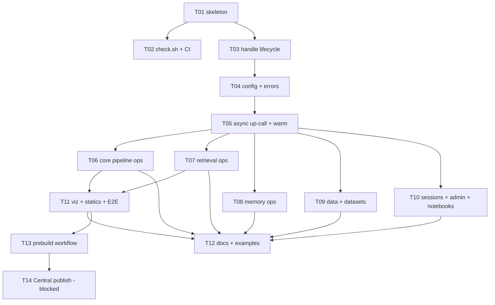

# Implementation plan: Java bindings for cognee-rust (JNI / jni-rs)

## 1. Introduction

This plan adds an official **Java SDK** (`ai.cognee:cognee`) as the fourth
language binding of cognee-rust, alongside Python (PyO3), JavaScript/TS (Neon),
and C (FFI). It is the executable decomposition of the approved design in
[`docs/design/java-bindings.md`](../../design/java-bindings.md). Read that design
doc once for rationale; this plan is the source of truth for *what to build and
in what order*. Where this plan and the design doc disagree, this plan wins
(it was re-derived from the current repository); where this plan and the
**repository** disagree, STOP and record it in the Deviations log (see §5).

The binding is **three layers**, exactly mirroring the OpenDAL Java pattern and
the existing neon crate:

- **L1 — Rust cdylib** (`java/cognee-java-jni/`): a standalone (non-workspace)
  crate, `crate-type = ["cdylib"]`, library name `cognee_java`. It depends on
  `cognee-bindings-common` and exposes **one JNI-exported function per
  `bindings-common` op**. It is *dumb and narrow*: parse JNI strings/handle,
  call the shared async op body on a process-wide tokio runtime, and complete a
  passed-in `java.util.concurrent.CompletableFuture` from the tokio worker
  thread via a JNI up-call. **No business logic; structured data crosses the
  boundary as JSON strings in both directions** (never field-by-field JNI
  object construction). This crate is the structural twin of
  `ts/cognee-ts-neon/src/` and its files are split by domain the same way
  (`runtime.rs`, `errors.rs`, `config.rs`, `sdk_ops.rs`, `sdk_retrieval.rs`,
  `sdk_memory.rs`, `sdk_data.rs`, `sdk_datasets.rs`, `sdk_admin.rs`,
  `sdk_visualization.rs`, `logging.rs`, `telemetry.rs`).

- **L2 — JNI shim (package-private Java)** (`ai.cognee.internal`): `Native`
  (a class of `static native` declarations, a 1:1 mirror of the L1 exports) and
  `NativeLibLoader` (classifier-jar native-library extraction + load). Never
  documented in the public Javadoc; excluded from `module-info` exports.

- **L3 — public Java SDK** (`ai.cognee`): `Cognee` + sub-accessors
  (`config()`, `datasets()`, `sessions()`, `notebooks()`, `users()`), the
  `CogneeException` hierarchy, the `SearchType` enum, typed result
  records/POJOs (Jackson-deserialized from the op JSON), `Options` builders that
  serialize to the exact same camelCase `opts` JSON the other bindings send, and
  `CompletableFuture<T>` async ergonomics. All ergonomics live here; L3 is pure
  Java and unit-testable without rebuilding Rust.

**How the executor uses this plan:** work one task at a time (see §5 Executor
protocol). Each task file (`T01`…`T14`) is standalone: it inlines the design
rules, names the exact files, gives verbatim boilerplate for the parts that must
be exact (JNI name mangling, the `catch_unwind` wrapper, the async up-call
lifecycle, the loader resource scheme, the version handshake), and provides a
fully worked example plus a table for the repetitive op families. Do not
redesign signatures; they are specified here.

## 2. Resolved decisions

Adopted from design-doc §9 (defaults taken as-is unless noted):

| # | Decision | Resolution |
|---|---|---|
| 1 | Java source/target floor | **17** (bytecode 61). `maven.compiler.release=17`. Rationale: the public API uses `record` types throughout (Java 16+), so 11 is infeasible (see §6, 2026-07-14). |
| 2 | Build tool for `java/` | **Maven** (single-module `java/pom.xml`). |
| 3 | JSON library | **Jackson** (`com.fasterxml.jackson.core:jackson-databind`, latest 2.x). Used only in L3 for (de)serializing op JSON ↔ typed records. L1 uses `serde_json`. |
| 4 | Package / group naming | `ai.cognee` group, artifact `cognee`, packages `ai.cognee` (public) + `ai.cognee.internal` (shim). Code is written against this now; **Central namespace ownership is infra — see decision #8 and task T14 (Blocked: infra).** |
| 5 | JNI method registration | **Name-mangled exports** (`Java_ai_cognee_internal_Native_<method>`), not `RegisterNatives`. Rationale: each op is one self-contained `#[unsafe(no_mangle)] pub extern "system" fn`; a per-function mistake fails only that function instead of the whole registration table, and there are no overloaded native methods (every native method has a unique camelCase name, so no signature suffix is needed). |
| 6 | Handle representation | **`long`** holding `Box::into_raw(Box::new(Arc<HandleState>))`. Ownership + free live in one place (`lib.rs` new/destroy). Ops deref the pointer, `Arc::clone`, and move the clone into the spawned task, so a concurrent `destroy` never dangles an in-flight task. |
| 7 | Progress / watcher / pipeline extras | **Excluded from v1** (ops-parity only). The neon `pipeline*`, `watcher*`, `progress*`, `cancellation*`, `value*`, `task*` exports are **not** ported. |
| 8 | Sonatype / Central credentials | **Infra prerequisite** (cannot be done by code). Task T14 is marked **blocked** on it. |

Additional resolved decisions:

- **`jni` crate version: pinned to `0.21` (resolves to 0.21.1).** The newest
  published version is `0.22.4` (released 2026-03-16), but the entire `0.22.x`
  line is a ground-up API rewrite (`JNIEnv` → `Env`, reworked
  `attach_current_thread*` / `AttachConfig`, new exception handling) released
  only months before this plan, with `0.22.0` and `0.22.1` **already yanked**.
  The design's whole rationale is the OpenDAL Java binding, which uses `jni`
  0.21. 0.21.1 is the battle-tested, widely-documented, OpenDAL-proven API and
  is what every code sample in this plan is written against. Revisiting 0.22.x
  is an explicit post-v1 item. **The executor must not "upgrade" to 0.22 while
  following this plan** — the up-call code would not compile.
- **OTEL service-name default: `cognee.java-binding`** (mirrors neon's
  `cognee.node-binding`, capi's equivalent).
- **Telemetry host-SDK sentinel:** Java's analytics arming honours the same
  `COGNEE_HOST_SDK` / `TELEMETRY_DISABLED` / `ENV∈{test,dev}` policy as the
  other bindings, via `cognee_telemetry::env::{arm_binding_emission, is_disabled}`.

### Divergences found between design doc and repository

1. **Admin ops grouping.** Design §4 lists separate `cognee.admin()` (resets)
   and `cognee.users()` (`getOrCreateDefault`) accessors. The TS reference
   (`ts/src/cognee.ts`) puts **all three** on a single `users` accessor:
   `getOrCreateDefault`, `resetPipelineRunStatus`,
   `resetDatasetPipelineRunStatus`. This plan follows the TS reality — Java
   exposes `cognee.users()` with those three methods and **no** `admin()`
   accessor. (The Rust op bodies live in `bindings-common/src/ops/admin.rs`
   regardless; the L1 shim file is still named `sdk_admin.rs`.)
2. **`SdkError` variant set.** Design §5 emphasizes `CONFIG_TYPE_MISMATCH` and
   "validation". The actual `crates/bindings-common/src/error.rs` `code()`
   strings are exactly: `COMPONENT_ERROR`, `SERVICE_BUILD_ERROR`,
   `USER_BOOTSTRAP_ERROR`, `RUNTIME_ERROR`, `VALIDATION_ERROR`, `UNSUPPORTED`,
   `FEATURE_NOT_BUILT`. Config errors are a **separate** enum
   `cognee_lib::config::ConfigError` with codes `UNKNOWN_CONFIG_KEY` and
   `CONFIG_TYPE_MISMATCH` (see neon `config.rs::throw_config_error`). The Java
   error mapping (T04) must cover **both** code sets.
3. **No `close()` in the TS SDK.** The neon `Cognee` has no `close()`/dispose;
   the handle is GC-managed. Java v1 **adds** `close()` (`AutoCloseable`) plus a
   `Cleaner` backstop per design §4 — this is intentional Java ergonomics, not a
   parity break (the underlying native handle needs explicit freeing without a
   JS-style finalizer).
4. **`recall` scope values.** `opts.scope` accepts the snake_case strings
   `auto`, `graph`, `session`, `trace`, `graph_context`, `all` (a string or
   string array) — see `bindings-common/src/ops/retrieval.rs::build_scope_input`.
5. **`add`/`remember` "text" input key.** `bindings-common/src/wire.rs`
   `marshal_inputs` accepts `{type:"text",text}`, `{type:"file",path}`,
   `{type:"url",url}`, `{type:"binary",bytes,name}`. `bytes` may be base64 (the
   neon crate depends on `base64` for exactly this). Verify the exact key names
   against `wire.rs` in T06 before finalizing the `DataInput` builder.

## 3. Task index

| ID | Title | Status | Depends on | Exit criterion |
|---|---|---|---|---|
| T01 | Rust shim crate + Maven project skeleton, `NativeLibLoader`, version handshake | done | — | `cargo build` in `java/cognee-java-jni` emits `libcognee_java`; `mvn -q -f java/pom.xml compile` succeeds; a JUnit test loads the lib and asserts `Native.version()` equals the Maven project version. |
| T02 | `java/scripts/check.sh` + wire into `check_all.sh` + `ci.yml` `java-check` job | done | T01 | `scripts/check_all.sh` runs the Java stage and passes; `check.sh` no-ops with a clear message when no JDK/Maven present; `ci.yml` has a `java-check` job wired into `notify`. |
| T03 | Handle lifecycle: `nativeNew`/`nativeDestroy`, `Cognee` (`AutoCloseable` + `Cleaner`) | done | T01 | `new Cognee(Map.of(...))` + `close()` round-trips; use-after-close throws `IllegalStateException`; double-close is a no-op. Verified by JUnit. |
| T04 | Config surface (`set`/`setStr`/4 bulk/`get`) + `ConfigError` mapping | done | T03 | `config().set`/bulk/`get` round-trip against a temp-dir handle; a type error surfaces as `CogneeException` with `code()=="CONFIG_TYPE_MISMATCH"`; JUnit green. |
| T05 | **Async up-call machinery** + `warm()` + `ownerId()` | done | T04 | `warm().join()` completes; a forced-error path completes the future exceptionally with a `CogneeException`; `-Xcheck:jni` test run produces no warnings; JUnit green. |
| T06 | Core pipeline ops: `add`, `cognify`, `addAndCognify` + typed results | done | T05 | `add(...).join()` returns a typed `AddResult` against sqlite temp dir (no LLM); JUnit green. |
| T07 | Retrieval ops: `search`, `recall` + `SearchType` enum + result types | done | T05 | `SearchType` maps to exact wire strings; `search`/`recall` compile and deserialize canned JSON; JUnit green. |
| T08 | Memory ops: `remember`, `rememberEntry`, `memify`, `improve` | done | T05 | All four wired with builders matching the camelCase opts; JUnit green (deserialization + arg-marshalling unit tests). |
| T09 | Data + dataset ops: `forget`, `update`, `pruneData`, `pruneSystem`, `datasets().*` | done | T05 | `datasets().list()`/`listData()`/`has()`/`status()`/`empty()`/`deleteData()`/`deleteAll()` + `forget`/`update`/prune wired; `add` + `datasets().list()` deterministic test passes; JUnit green. |
| T10 | Session + admin/user + notebook ops | done | T05 | `sessions().*`, `users().*` (incl. resets + `getOrCreateDefault`), `notebooks().*` wired; JUnit green. |
| T11 | Visualization ops (feature-gated) + static setup methods + LLM-gated E2E | done | T06, T07 | `visualize`/`visualizeToFile` feature-gated; `setupLogging`/`initOtlp`/`initTelemetry`/`version` statics; `warm→add→cognify→search` integration test skips without `OPENAI_URL`/`OPENAI_TOKEN`; JUnit green. |
| T12 | Docs + examples + Javadoc + README | done | T06, T07, T08, T09, T10, T11 | `docs/architecture.md`, `docs/tools/bindings.md`, `docs/tools/README.md`, root `README.md`, `.claude/CLAUDE.md` updated; `java/README.md` + runnable example added; `mvn -q -f java/pom.xml javadoc:javadoc` succeeds. |
| T13 | `java-prebuild.yml` classifier-jar workflow (4-target matrix) | done | T11 | Workflow builds the cdylib on the 4-target matrix and produces per-classifier jars; validated locally by building one classifier jar. |
| T14 | Maven Central publishing wiring | done | T13 | Publishing wiring authored: `release`/`attach-natives` pom profiles (sources+javadoc+GPG+central-publishing plugin) and a token-gated `publish` job in `java-prebuild.yml` that silently skips without the Central token. Namespace resolved to the GitHub-verified `io.github.topoteretes` (see §6). Remaining to actually publish is operator action only (GPG key + repo secrets), not code. |

## 4. Dependency graph

**Parallelizable:** T02 and T03 may run in parallel after T01. After T05 lands,
**T06, T07, T08, T09, T10 are mutually independent** and may be done in any
order or in parallel (each touches its own `sdk_*.rs` and its own L3 files; the
only shared file is `Native.java` and `lib.rs`, whose native-method lists grow
by append — coordinate those two files to avoid merge conflicts). T11 needs the
result-type plumbing proven by T06/T07. T12 documents everything, so it comes
last before packaging.

## 5. Executor protocol

1. **One task per session** unless explicitly told otherwise.
2. **Before starting a task:** re-read its task file top to bottom, then
   re-verify every item in its "Dependencies & preconditions" section against
   the *current* repo (run the commands / open the files it lists). Set the
   task's Status to `in-progress` in the §3 table of **this README** (statuses
   live only here, never inside task files).
3. **Do the Steps in order.** Follow the verbatim boilerplate exactly. Honour
   repo conventions: **no `unwrap()` in non-test Rust** (use
   `expect("invariant …")` with a real justification, or propagate); library
   Rust uses `thiserror`, binaries/examples use `anyhow`; **every JNI entry
   point is panic-guarded**; structured data crosses as JSON (never
   field-by-field JNI object construction).
4. **Before marking done:** run the task's "Verification" commands and confirm
   the stated outcomes. Then set Status to `done` in the §3 table.
5. **If a precondition fails or reality diverges from the task file:** STOP.
   Do not improvise. Record the divergence in the Deviations log (§6) and either
   fix the task file (if the fix is obvious and in-scope) or surface the blocker.
   Append **one line to the Deviations log for every intentional departure from
   a task file**, however small.
6. **Green after every task:** `scripts/check_all.sh` must pass at the end of
   each task from T02 onward (T02 introduces the Java stage; before T02 the
   suite passes because it does not yet know about `java/`).

## 6. Deviations log

| Date | Task | Deviation | Reason |
|---|---|---|---|
| 2026-07-14 | T11 | Corrected the `EndToEndIT` LLM config keys in the task file from `provider`/`api_key`/`endpoint` to `llm_provider`/`llm_api_key`/`llm_endpoint`. | `ConfigManager::set_llm_config` (crates/lib/src/config.rs:1820-1836) only accepts `llm_`-prefixed keys and returns `ConfigError::UnknownKey` otherwise; the unprefixed keys would throw at `setLlmConfig` instead of running the E2E. Matches existing `CogneeConfigTest` usage. |
| 2026-07-14 | T11 | Implemented `initOtlp` as the full faithful port (not the minimal subset): ported `default_subscriber.rs` (`OTEL_RELOAD_HANDLE` + reload slot) into `sdk_static.rs` and wired `install_default_subscriber()` + `arm_analytics()` into `JNI_OnLoad` (parity with neon's `#[neon::main]` load hook). No `guard_jboolean` helper was needed — the `guard_jlong(..) as jboolean` cast passes clippy. | Keeps byte-for-byte parity with the neon binding so `initOtlp` installs the OTEL layer via the reload handle; without the load-time `install()` the handle would be `None`. The task's minimal-subset fallback was unnecessary. |
| 2026-07-14 | T12 | Corrected the `java/README.md` quickstart snippet (step 6) LLM config keys from `provider`/`api_key` to `llm_provider`/`llm_api_key`/`llm_endpoint`. | `CogneeConfig.setLlmConfig` passes keys straight through to the native op, and `ConfigManager::set_llm_config` (crates/lib/src/config.rs) only accepts `llm_`-prefixed keys, returning `UNKNOWN_CONFIG_KEY` otherwise — the unprefixed keys make the "runnable snippet" throw. Matches the T11 E2E fix and existing `CogneeConfigTest`/`EndToEndIT` usage. |
| 2026-07-14 | T09 | Java source/target floor changed from 11 → 17 (`maven.compiler.release=17` in the pom, bumped where T09 touched it); decision #1 (§2), T01, T02, `java/README.md`, and `java/scripts/check.sh` updated to say 17. | The public API uses `record` types throughout, which require Java 16+; an 11 floor is infeasible, so 17 is the standardized floor. |
| 2026-07-14 | T03/T05/T01 | Handle-safety hardening (code-review group G1): Java ops+accessors dispatch through a `ReentrantReadWriteLock` (`Cognee.dispatch`/`dispatchVoid`) with `Reference.reachabilityFence(this)` after each native call; `close()` takes the write lock; `handle()` made package-private. Rust `future.rs` up-call now runs in `with_local_frame` and best-effort-settles the future if the up-call fails; `JNI_OnLoad`'s non-trivial body is `catch_unwind`-guarded; async wrappers add a shared `checked_handle` null/zero guard; SAFETY comments updated to the enforced guarantee. | Fix Cleaner reachability race + concurrent-close UAF, unbounded JNI local-ref leak on daemon workers, `.join()` hang on failed up-calls, and UB from a panic in `JNI_OnLoad`; overstated SAFETY comments corrected to match the real invariants. |
| 2026-07-14 | Follow-up review | Removed the now-dead `Cognee.handle()`, settled the future when `with_local_frame` cannot push a frame, made the Windows native-lib cache SNAPSHOT-aware, and isolated the relational DB per test (`TestConfig.underTempDir`). | Findings from the high-effort review of the G1–G6 fix commits: dead accessor re-opened the UAF surface; frame-push failure left futures unsettled (`.join()` hang); same-version dev rebuilds loaded a stale DLL; `relational_db_url` defaulted to cwd-relative `./cognee.db`, leaking dedup/session state across runs so `mvn verify` was not idempotent. |
| 2026-07-15 | T14 | Maven groupId set to `io.github.topoteretes` (not the plan's provisional `ai.cognee`). | The registered/verified Central namespace is the GitHub-verified `io.github.topoteretes`; Central requires the groupId to sit under the verified namespace. Java package names remain `ai.cognee` (independent of the Maven coordinate). |
| 2026-07-15 | T14 | Publish job gates on `needs: [build-platform, check-token]` + `has_token == 'true'` (build-platform success required) rather than the task's `always()`. | `always()` would let the deploy run with a partial native set if a matrix leg failed; requiring build-platform success prevents publishing an incomplete classifier set. |
