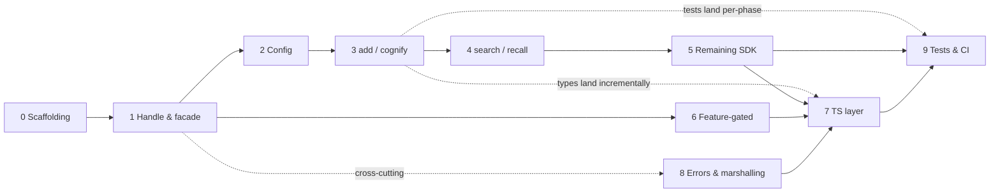

# TypeScript Bindings — Full-Functionality Plan (Index)

Status: **proposal / not started** · Owner: TBD · Last updated: 2026-06-03

This is the **overview and index**. The detailed, per-phase implementation plans live under
[`docs/typescript-bindings/`](typescript-bindings/). This page holds the shared context every
phase depends on: the problem, the reusable building blocks, the target architecture, the
service-facade design, the parity checklist, and the cross-cutting risks.

## Scope decisions (locked)

1. **Target = full parity** with `cognee-lib`'s public API.
2. **Keep the legacy `cognee-core` engine bindings, but de-emphasize** them under a
   `cognee.pipeline.*` namespace.
3. Marshalling is **JSON-based** (serde ↔ JS), not the low-level `Value` trait.

---

## 1. Problem in one paragraph

`js/` (package `@cognee/pipeline`, built with [Neon](https://neon-bindings.com/)) binds only
`cognee-core` — the generic task/pipeline engine. The entire user-facing cognee SDK (`add`,
`cognify`, `search`, `recall`, `remember`, `memify`, `forget`, `update`, `prune`, `improve`,
datasets, sessions, config) is **absent**. The same gap exists in the Python (`python/`) and C
(`capi/`) bindings. "Fully functional" means exposing the real SDK that `cognee-lib` already
implements, so a Node user can run `add → cognify → search` against real backends. The reason
nothing real is reachable today: `cognee-neon` depends only on `cognee-core` + `testing`-feature
mocks and has **no dependency on `cognee-lib`** — the only `TaskContext` is the in-memory mock.

## 2. Reusable building blocks (don't rebuild)

- **`ConfigManager`** (`crates/lib/src/config.rs`) — versioned, thread-safe `Settings` with
  granular + bulk setters and `from_env()`.
- **`ComponentManager`** (`crates/lib/src/component_manager.rs`) — lazy, version-cached
  `Arc<dyn Trait>` engines; implements **`PipelineContext`** (`crates/lib/src/context.rs`). But it
  yields **only 6 raw engines** (storage, database, graph_db, vector_db, embedding_engine, llm).
- **High-level API** (`crates/lib/src/api/`) — takes **explicit `Arc<dyn Trait>` handles**; e.g.
  `remember()` has 18 params. The CLI (`crates/cli/src/commands/`) is the reference for how to
  build everything and call it.
- **Neon async→Promise bridge** already proven in `js/cognee-neon/src/pipeline_exec.rs`
  (`cx.promise()` + `runtime().spawn(async { … deferred.settle_with(&channel, …) })`).

## 3. Target architecture

```
┌─ TypeScript (js/src/) ───────────────────────────────────────────┐
│  class Cognee                                                     │
│    ctor(settings?) · config setters · add/cognify/search/recall   │
│    remember/memify/forget/update/prune/improve/datasets/sessions  │
│    visualize/serve (feature-gated)                                │
│    .pipeline.*  (legacy cognee-core engine)                       │
└───────────────────────────────────────────────────────────────────┘
                              │ Neon promises
┌─ Rust (js/cognee-neon/src/) ─────────────────────────────────────┐
│  CogneeHandle { cm: Arc<ComponentManager>, runtime, owner_id }    │
│    .services() → CogneeServices (6 engines + derived services)    │ ← §4
│    sdk_* : svc = .services() → call cognee-lib api → serde_to_js  │
│  services.rs · config.rs · json.rs · errors.rs · sdk_*.rs         │
│  + existing engine modules (pipeline/task/value/watcher/…)        │
└───────────────────────────────────────────────────────────────────┘
                              │ depends on
                     cognee-lib (ConfigManager, ComponentManager, api/)
```

## 4. The service facade (keystone for consistency)

`ComponentManager` gives 6 raw engines; the API functions need **many derived services** too.
Rather than re-wire them per binding function (fragmentation → drift), a **single
`CogneeServices` facade** lazily builds and caches everything in one place, version-invalidated
like `ComponentManager`:

| Derived service | Built from |
|---|---|
| `thread_pool` | `RayonThreadPool::with_default_threads()` |
| `pipeline_run_repo` | `SeaOrmPipelineRunRepository::new(db)` |
| `add_pipeline` | `AddPipeline::new(storage, db).with_*()` |
| `delete_service` | `DeleteService::new(...)` |
| `search_orchestrator` | `SearchBuilder::new(...).with_*().build()` |
| `session_store` / `session_manager` | per `cache_backend` |
| `ontology_resolver` | per config (RdfLib / NoOp) |
| `cognify_config` | from `Settings` |
| `checkpoint_store` | optional, per config |

**Canonical call pattern** (every `sdk_*` function):
`let svc = handle.services().await?;` → call the `cognee-lib` API with `svc.*` handles →
`serde_to_js`. Detailed in [phase-1](typescript-bindings/phase-1-handle-and-services.md).

## 5. Complete SDK surface to cover (parity checklist)

Authoritative target. Sourced from `crates/lib/src/lib.rs` and `crates/lib/src/api/mod.rs`.

| # | Surface | Rust entry point | Phase |
|---|---|---|---|
| 1 | `add` | `AddPipeline` | 3 |
| 2 | `cognify` | `cognify()` | 3 |
| 3 | `search` | `SearchBuilder`→`SearchOrchestrator` (15 `SearchType`) | 4 |
| 4 | `recall` | `api::recall` + `RecallScope`/`ScopeInput` | 4 |
| 5 | `remember`/`remember_entry` | `api::remember` | 5 |
| 6 | `memify` | `cognify::run_memify` + `MemifyConfig` | 5 |
| 7 | `forget` | `api::forget` (`ForgetTarget`/`DatasetRef`) | 5 |
| 8 | `delete` (raw) | `DeleteService` | 5 |
| 9 | `update` | `api::update` | 5 |
| 10 | `prune` | `api::prune_data` + `prune_system` | 5 |
| 11 | `improve` | `api::improve` (`ImproveParams`) | 5 |
| 12 | `DatasetManager` | `api::DatasetManager` | 5 |
| 13 | sessions | `lib::session::*` | 5 |
| 14 | pipeline-run resets | `api::pipeline_runs::*` | 5 |
| 15 | default user | `api::user::get_or_create_default_user` | 5 (used in 1) |
| 16 | notebooks | `api::notebooks::*` | 5 (scope TBD) |
| 17 | config | `ConfigManager` setters + `Settings` | 2 |
| 18 | `visualize` | `visualization::visualize` (feature) | 6 |
| 19 | `serve`/`disconnect` | `cloud::*` (feature) | 6 |
| L | legacy engine | `cognee-core` | 7 |

Out of scope: HTTP routers, auth, permissions, the `http` server surface.

## 6. Phase index

| Phase | Doc | Outcome |
|---|---|---|
| 0 | [Scaffolding & build](typescript-bindings/phase-0-scaffolding.md) | `cognee-neon` links `cognee-lib`; loadable `.node`; packaging story |
| 1 | [Handle & service facade](typescript-bindings/phase-1-handle-and-services.md) | `CogneeHandle` + `CogneeServices` — the keystone |
| 2 | [Config surface](typescript-bindings/phase-2-config.md) | All config settable from TS; real backends usable |
| 3 | [Pipeline ops](typescript-bindings/phase-3-pipeline-ops.md) | `add`, `cognify`, `add-and-cognify` |
| 4 | [Retrieval](typescript-bindings/phase-4-retrieval.md) | `search`, `recall` |
| 5 | [Remaining SDK](typescript-bindings/phase-5-remaining-sdk.md) | remember/memify/forget/update/prune/improve/datasets/sessions/… |
| 6 | [Feature-gated surfaces](typescript-bindings/phase-6-feature-gated.md) | `visualize`, `serve`/`disconnect` |
| 7 | [TypeScript layer & actualization](typescript-bindings/phase-7-typescript-layer.md) | `Cognee` class, types, legacy re-homing, existing-code changes |
| 8 | [Errors & marshalling](typescript-bindings/phase-8-errors-marshalling.md) | Typed JS errors; one JSON path |
| 9 | [Tests & CI](typescript-bindings/phase-9-tests-ci.md) | Tier-A (CI) + Tier-B (gated) tests, example, docs |

To execute a phase, use the reusable
[**Task Execution Template**](typescript-bindings/TASK-EXECUTION-TEMPLATE.md) — it chains four
sub-agents (plan-correction → implementation → code-review → commit) with gating between them.
Track progress in [**STATUS.md**](typescript-bindings/STATUS.md) (per-phase status, exit-criteria
checklists, and a decision log).

## 7. Sequence plan

The recommended execution order, the dependencies between phases, and the milestones that gate
progress. Phase 1 is the de-risking keystone; once the facade is right, Phases 3–6 are mechanical.

### Dependency graph



### Ordered tracks

1. **Foundation (strictly sequential): 0 → 1 → 2.** Nothing real works until the crate links
   `cognee-lib`, the `CogneeServices` facade exists, and config is settable. Do not parallelize.
2. **Core SDK (sequential, the value path): 3 → 4 → 5.** Each needs the previous (search needs
   cognified data; the remaining API reuses the same facade + marshalling).
3. **Layered, can overlap with track 2:**
   - **6 Feature-gated** depends only on Phase 1 — start any time after the facade.
   - **8 Errors & marshalling** is cross-cutting — stub a minimal version in Phase 1, harden after 5/6.
   - **7 TS layer** grows incrementally (add the typed method as each native op lands), then a
     final consolidation pass after 5/6/8.
4. **Verification (continuous): 9.** Tier-A tests land with each op phase; consolidate + add the
   Tier-B e2e and CI wiring at the end.

### Milestones

| Milestone | Reached after | Demonstrable outcome |
|---|---|---|
| **M0 — Foundation compiles** | 0 | `.node` linking `cognee-lib` loads; legacy engine tests pass |
| **M1 — Real backends wired** | 1–2 | `Cognee` constructs; `services()` builds; config drives engine selection |
| **M2 — Graph built from Node** | 3 | live `add → cognify`; deterministic `add` green in CI |
| **M3 — Round-trip query** | 4 | `add → cognify → search` / `recall` from Node |
| **M4 — Full API parity** | 5 (+6) | every `cognee-lib` `api/` function reachable; checklist complete |
| **M5 — Shippable SDK** | 7–9 | typed `Cognee` class, typed errors, example, Tier-A green in CI, Tier-B gated |

### Per-phase prerequisites

| Phase | Requires | Unblocks |
|---|---|---|
| 0 | — | 1 |
| 1 | 0 | 2, 6, (8 stub) |
| 2 | 1 | 3 |
| 3 | 1, 2 | 4, 9(Tier-A) |
| 4 | 3 | 5 |
| 5 | 1, 2 (data ops need 3) | 7, 9 |
| 6 | 1 | 7 |
| 7 | native ops from 1–6, 8 | 9 |
| 8 | min. stub in 1; full after 5/6 | 7 |
| 9 | per-phase Tier-A; Tier-B after 3–5 | release |

## 8. Cross-cutting risks & open questions

- **`[patch.crates-io]` forks** — `cognee-neon` carries its own qdrant `tar`/`tonic`/`hyper`
  patches; linking `cognee-lib` must reconcile them (Phase 0).
- **Standalone vs workspace** — keep `cognee-neon` standalone (mirror patches) or join the
  workspace (inherit patches + cache, tighter coupling). Decided in Phase 0.
- **Build time / binary size** — `.node` is ~19 MB engine-only; the full lib (ONNX, qdrant,
  ladybug, tokenizers) grows it. Feature-gate heavy backends.
- **Promote `CogneeServices` to `cognee-lib`?** Would let Python/C/CLI share one construction
  path. Build in the binding first; extract once stable.
- **Package identity** — rename `@cognee/pipeline` to a full-SDK name, or re-scope? (Phase 7.)
- **Notebooks scope (#16)** — SDK concern or HTTP-only? Confirm before binding.
- **Runtime lifecycle** — the handle should not need a separate `init()`; make init idempotent.

## 9. Reference map

| Concern | Location |
|---|---|
| Neon module registration | `js/cognee-neon/src/lib.rs` |
| TS entry / exports | `js/src/index.ts` |
| Neon async→Promise pattern | `js/cognee-neon/src/pipeline_exec.rs` |
| Value marshalling (extend → JSON) | `js/cognee-neon/src/value.rs` |
| Error hierarchy | `js/cognee-neon/src/error.rs` |
| Crate manifest (add cognee-lib) | `js/cognee-neon/Cargo.toml` |
| ConfigManager / Settings | `crates/lib/src/config.rs` |
| ComponentManager / PipelineContext | `crates/lib/src/component_manager.rs`, `crates/lib/src/context.rs` |
| High-level API | `crates/lib/src/api/` |
| cognify() free function | `crates/cognify/src/tasks.rs` |
| CLI reference commands | `crates/cli/src/commands/` |
| CI: `js-check` job → `js/scripts/check.sh` | `.github/workflows/ci.yml` |
| Rust LLM-gated test pattern | `scripts/run_tests_with_openai.sh` |
